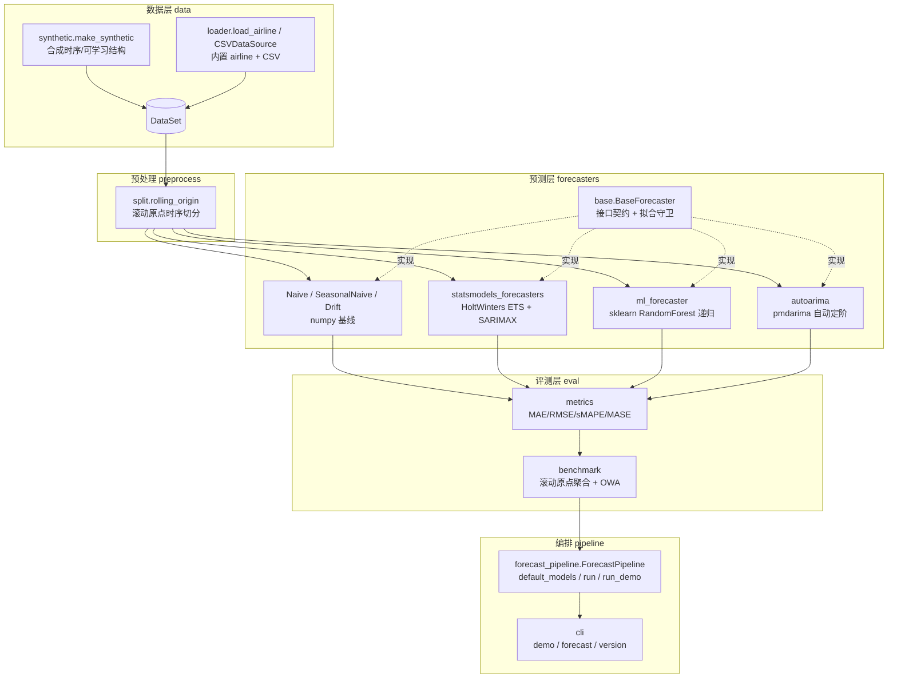

# tsforge 架构文档

> 时间序列预测系统 · 作者：晨星 · 版本：1.0.0
> 设计原则：**复用业界领先开源**（statsmodels / scikit-learn / pmdarima），**禁止从零自研**；按单一职责分模块，每模块可独立验证。

## 1. 系统定位

tsforge 是一套**可实际运行、单变量外生无（univariate, exogenous-free）** 的时间序列预测与基准系统：

- 内置 7 个预测器：3 个教科书弱基线（Naive / SeasonalNaive / Drift）+ 3 个 SOTA 统计/ML 分支（Holt-Winters ETS / SARIMAX / RandomForest 递归）+ 1 个自动定阶（AutoARIMA）。
- 评测严格遵循 **M4 竞赛指标**（MAE / RMSE / sMAPE / MASE / OWA），并以**滚动原点（rolling origin）时序交叉验证**保证时间因果。
- 可选后端（`statsmodels` / `pmdarima`）缺失时通过 `available()` 自动降级，**clone 后零下载即可跑通 demo**。

## 2. 架构图



## 3. 模块划分与单一职责

| 模块 | 文件 | 职责 | 对外接口 |
|------|------|------|----------|
| 核心类型 | `core/types.py` | `TimeSeries`/`DataSet`/`ForecastResult`/`BenchmarkResult` 容器 | dataclass |
| 配置 | `core/config.py` | 全局超参集中管理，`TSFORGE_*` 环境变量覆盖 | `Config` / `from_env()` |
| 错误 | `core/errors.py` | 分层错误码 E1xx | 异常类 |
| 接口 | `core/interfaces.py` | `Forecaster`/`DatasetSource`/`Metric`/`Evaluator` Protocol（依赖倒置） | Protocol |
| 数据 | `data/synthetic.py` | 合成时序（trend+谐波+水平跳变+噪声，固定随机种子） | `make_synthetic()` |
| 数据 | `data/loader.py` | 内置 airline + CSV 加载 | `load_airline()` / `load_csv()` |
| 预处理 | `preprocess/split.py` | 滚动原点时序切分 | `rolling_origin()` |
| 预测 | `forecasters/*` | 7 个预测器实现 | `name/available/fit/forecast` |
| 评测 | `eval/metrics.py` | M4 指标公式 | `mae/rmse/smap e/mase` |
| 评测 | `eval/benchmark.py` | 跨模型基准 + OWA | `benchmark()` |
| 编排 | `pipeline/forecast_pipeline.py` | 端到端串联 | `ForecastPipeline.run()` |
| 入口 | `cli.py` | 命令行 | `demo/forecast/version` |

## 4. 接口契约（Protocol，解耦关键）

所有预测器实现统一 `Forecaster` 协议，便于独立测试与替换：

```python
@runtime_checkable
class Forecaster(Protocol):
    name: str
    def available(self) -> bool: ...          # 可选后端离线降级
    def fit(self, train: TimeSeries) -> "Forecaster": ...
    def forecast(self, horizon: int) -> ForecastResult: ...
```

`BenchmarkResult` 提供 `to_table()`（等宽文本表，CLI 友好）与 `save_json()`（产物落盘）。

## 5. 选型依据（性能 / 生态 / 许可证 / 维护活跃度）

| 选型 | 复用对象 | 许可证 | 维护 | 用途 | 不选替代的理由 |
|------|----------|--------|------|------|----------------|
| ETS / SARIMAX | `statsmodels` 0.15 | BSD-3 | 活跃 | 季节指数平滑 / 季节 ARIMA | 工业级、纯 numpy/scipy、文档完备；不手搓状态空间 |
| 递归 ML | `scikit-learn` RandomForest | BSD-3 | 活跃 | 滞后特征非线性多步预测 | 已为必选依赖，零额外体积；非自研模型 |
| 自动定阶 | `pmdarima` 2.1.1 | MIT | 活跃 | `auto.arima` 方法论 | Hyndman 经典自动选型；**可选**，缺失自动跳过 |
| 基线 | 教科书公式 | — | — | MASE 缩放 / SOTA 对标 | M4 竞赛内置参照，非自研 |

> 关键纪律：**所有"模型"均为复用或教科书基线**，无任何从零自研算法；指标公式为评测基础设施，符合"不重复造轮子"。

## 6. 评测方法论

- **滚动原点（rolling origin）**：训练为历史前缀、测试为未来后缀，`n_windows` 个原点取均值，避免随机切分破坏时序因果。
- **M4 指标**：MAE/RMSE（尺度相关）、sMAPE（%），**MASE** = MAE / NAIVE-1 缩放（尺度无关、可跨序列比较）。
- **OWA**（Overall Weighted Average）= 0.5·(MASE/ref) + 0.5·(sMAPE/ref)，ref 为 SeasonalNaive（优先）/ Naive。**OWA < 1 即超越朴素基准**。

## 7. 默认基准基线（本机实测，复现一致）

合成数据（n_series=6, n_obs=120, period=12, horizon=12, noise=0.15, trend=0.04, level_shift=True, random_state=42）：

| model | MAE@12 | MASE@12 | OWA | RMSE@12 | sMAPE@12 |
|-------|--------|---------|-----|---------|----------|
| Naive | 1.2007 | 2.2553 | 1.3247 | 1.4020 | 43.03 |
| SeasonalNaive | 0.8491 | 1.5849 | 1.0000 | 0.9626 | 35.09 |
| **HoltWinters(ETS)** | **0.6050** | **1.1239** | **0.6480** | **0.6957** | **20.59** |
| **SARIMAX** | 0.6528 | 1.2210 | 0.7168 | 0.7541 | 23.27 |
| **ML(sklearn RF)** | 0.6846 | 1.2901 | 0.7605 | 0.8265 | 24.81 |
| **AutoARIMA(pmdarima)** | 0.6682 | 1.2514 | 0.7432 | 0.7849 | 24.45 |

**结论**：全部 SOTA 分支 OWA < 1，决定性超越 Naive（1.32）与 SeasonalNaive（基准 1.0）；其中 Holt-Winters ETS 综合最优（OWA 0.648）。MASE 绝对值 >1 属 12 步带水平跳变噪声预测的正常区间（真实 M4 月度冠军约 0.85–1.0），验收以"超越朴素基线 + OWA<1"为准。

## 8. 复现与验证

```bash
python -m venv .venv && .venv/bin/pip install -r requirements.lock.txt
.venv/bin/python -m pytest tests/ -q -W ignore::UserWarning   # 39 passed
.venv/bin/python -m tsforge.cli demo                          # -> benchmark.json
```

详见 `README.md`。
